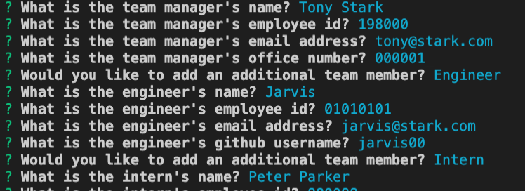
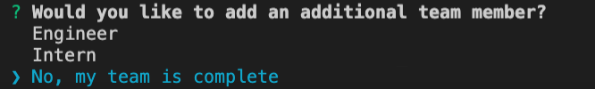
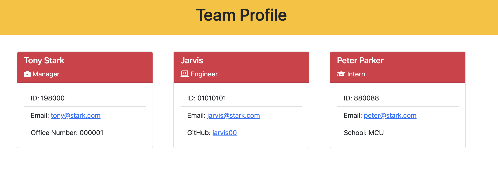

# Team Profile


## Description
The purpose of this application is to help managers quickly create a team roster using the command-line prompt.  Users will answer a series of questions, after which a nicely formatted HTML page is created containing the team members.

Highlights for this project:
- Developed using Node.js
- Use of NPM Inquirer package to facilitate command-line prompts for user input
- Use of NPM Jest package for testing
- File System module for creating index.html file
- Objects created leveraging class and subclass structures

## Table of Contents
- [User-Story](#user-story)
- [Installation](#installation)
- [Usage](#usage)
- [License](#license)
- [Contributing](#contributing)
- [Tests](#tests)
- [Demo](#demo)
- [Questions](#questions)

## User-Story

```md
AS A manager
I WANT to generate a webpage that displays my team's basic info
SO THAT I have quick access to their emails and GitHub profiles
```
## Installation
This code requires the following to be installed:
- Node.js
- [Inquirer package](https://www.npmjs.com/package/inquirer)
- [Jest package](https://www.npmjs.com/package/jest) to use provided test scripts

Note: consider creating a .gitignore file and include node_modules so that your node_modules directory is not tracked or uploaded to GitHub in the future. Be sure to create your. .gitignore file before installing any npm dependencies.


## Usage
To use this application, first run the command ‘node index' to start the prompts.  Answer each prompt to create the team manager.  If a user enters a non-number for the Employee ID, the system will request you to re-enter the value.  If a user enters an invalid format for the email question, the system will request you to re-enter the value.



After the details for one team member have been completed, the system will ask whether you want to add another person (either an engineer or an intern).  If the user selects another team member, they will go through another series of prompts related to that employee type. Otherwise, the user has the option to complete the team creation process.



Once the user finishes creating their team, a new index.html file will be created under the 'dist' folder containing all the entered team members.



## License
This application is covered under the [License: MIT](https://opensource.org/licenses/MIT).


## Contributing
Resources from this project:
- Node.js
- NPM Inquirer package
- NPM Jest package
- Boostrap
- Font Awesome


## Tests
This application uses NPM package Jest for testing. Included with this repo are a series of test cases for the following classes:
- Employee
- Engineer
- Intern
- Manager

To initiate a test run, use the command 'npm test'.

## Demo
[Video Demo]()

You can see a sample team HTML file generated from this application under the 'dist' folder.

## Questions
Contact Details:

- GitHub Username: mel-ificent
- [Link to GitHub Profile](https://github.com/mel-ificent)
- For additional questions, you can contact me via email: melissadonato11@gmail.com